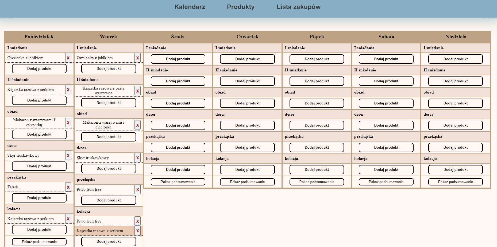

# Food-Planner

This is a food planner website

## Table of contents

- [Overview](#overview)
  - [Features](#Features)
  - [Screenshot](#screenshot)
  - [Links](#links)
- [Author](#author)
- [My process](#my-process)
  - [Built with](#built-with)
  - [What I learned](#what-i-learned)

## Overview

### Features

Users should be able to:

- View the optimal layout for the app depending on their device's screen size
- Prepare products list
- Create, Read, Update, and Delete products and ingredients
- Add products to week calendar
- See products and day resumes (depending on products weight and macro details)
- Keep application state by saving data in `localStorage` (Save current state after refreshing)
- Prepare shopping list (Work in progress)

### Screenshot

### Links

- Solution URL: [Solution](https://github.com/wojciech94/Food-Planner/)
- Live Site URL: [Site](https://wojciech94.github.io/Interactive-Comments-Section/)

## Author

- Website - [Wojciech94](https://github.com/wojciech94)
- Frontend Mentor - [@wojciech94](https://www.frontendmentor.io/profile/wojciech94)

## My process

### Built with

- Semantic HTML5 markup
- SCSS preprocessor
- Flexbox
- BEM architecture
- Vanilla Javascript
- JSON data fetch
- Local Storage

### What I learned

- Improved using arrays and classes
- Learnt how to store complex data in local storage
- Improved how to extract json object into class instance object
